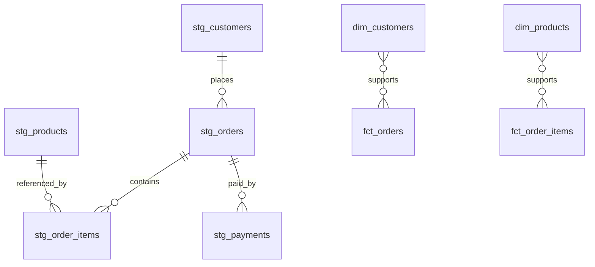

# dbt ecommerce mart 🛒⚡  
**Local-first E-commerce Analytics Mart built with dbt + DuckDB**  
Clean modeling. Reliable tests. Warehouse-style marts. Zero cloud bills.

---

## ✨ What this is
**dbt ecommerce mart** takes raw e-commerce data (**CSV seeds**) and transforms it into a modern analytics layer using **dbt** on **DuckDB**.

You get a realistic warehouse-style structure:

- **Staging models**: cleaned, typed, standardized inputs  
- **Intermediate models**: business logic + derived calculations  
- **Marts**: `dim_*` and `fct_*` tables for dashboards and analysis  
- **Quality gates**: dbt tests (unique, not_null, relationships, accepted values)  
- **Scale patterns**: incremental facts + snapshots (SCD2-style history)

---

## 🧱 Tech Stack
- **dbt** (transformations, tests, docs)
- **DuckDB** (local analytics database)
- **CSV Seeds** (raw input data)

---

## 🚀 Quickstart

### 1) Install
```bash
pip install dbt-duckdb
```

### 2) Configure profile (DuckDB)
Create / update your `profiles.yml` (Windows default location: `C:\Users\<you>\.dbt\profiles.yml`)

```yml
dbt_ecommerce_mart:
  target: dev
  outputs:
    dev:
      type: duckdb
      path: dbt_ecommerce_mart.duckdb
      schema: analytics
```

### 3) Run
```bash
dbt seed
dbt run
dbt test
dbt snapshot
```

### 4) Docs
```bash
dbt docs generate
dbt docs serve
```

---

## 🗂️ Project Structure
```txt
models/
  staging/        -- raw → clean & typed (stg_*)
  intermediate/   -- business logic (int_*)
  marts/          -- analytics layer (dim_*, fct_*)
snapshots/        -- history tracking (SCD-style)
seeds/            -- raw CSV datasets
macros/           -- reusable SQL helpers
```

---

## 🧠 Core Models

### Staging
- `stg_customers`
- `stg_products`
- `stg_orders`
- `stg_order_items`
- `stg_payments`

### Intermediate
- `int_order_revenue`
- `int_customer_order_stats`

### Marts
- `dim_customers`
- `dim_products`
- `fct_orders`
- `fct_order_items` (**incremental**)

---

## ✅ Data Quality (dbt tests)
Includes:
- **unique** + **not_null** (IDs & keys)
- **relationships** (FK integrity)
- **accepted_values** (status/domain validation)

These tests act like guardrails so broken data doesn’t silently reach your marts.

---

## ⏱️ Incremental Strategy
`fct_order_items` is built as an **incremental model** (with a `unique_key`) so it scales like real warehouse pipelines.

---

## 🕰️ Snapshots (Customer History)
Customer attributes change over time — snapshots capture history (SCD-style).

- Snapshot: `snap_customers`
- Output schema: `snapshots`

---

## 🗺️ Data Model (High-level)


---

## 🔎 Example Questions You Can Answer
- Revenue trend by day/week/month
- Top customers by **LTV**
- Best-selling products by revenue
- Payment success rate (paid vs failed)
- Repeat purchase patterns

---

## 🧪 Example Queries (DuckDB)
```sql
-- Top 5 customers by LTV
select
  full_name,
  lifetime_value
from analytics.dim_customers
order by lifetime_value desc
limit 5;

-- Revenue trend by day
select
  order_date,
  sum(gross_revenue) as revenue
from analytics.fct_orders
where status = 'completed'
group by 1
order by 1;
```

---

## 📄 License
MIT
